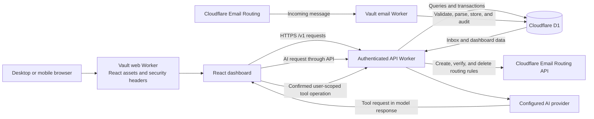
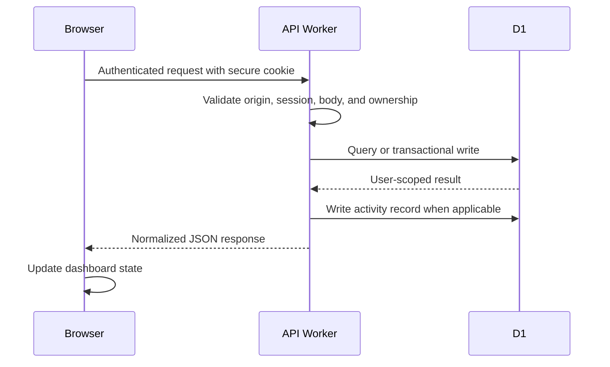
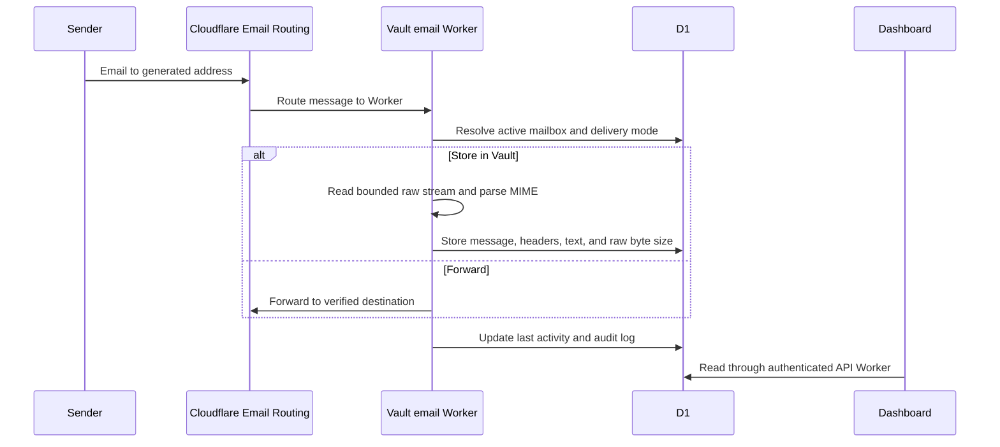

# Vault

Vault is a private digital workspace for managing account credentials, encrypted secrets, TOTP authentication codes, temporary email inboxes, notes, integrations, AI-assisted actions, and security activity from one responsive dashboard.

The application is built as a React single-page application backed by Cloudflare Workers and Cloudflare D1. Separate Workers handle the web application, authenticated API traffic, and incoming email so each runtime has a clear responsibility.

## Product Areas

| Area | What it does | Main data |
| --- | --- | --- |
| Dashboard | Summarizes accounts, inbox activity, unread messages, storage, and recent events | Aggregated D1 queries |
| Vault | Stores encrypted API keys, tokens, configuration, credentials, and private notes | `vault_secrets` |
| Accounts | Organizes login details, platform metadata, plans, status, expiration, and linked 2FA codes | `accounts` |
| Auth 2FA | Imports or creates TOTP entries and generates time-based verification codes | `authenticator_entries` |
| Email Generator | Creates Cloudflare-routed addresses with private inboxes or verified forwarding | `generated_email_addresses`, `received_emails` |
| AI Chat | Connects to supported AI APIs, stores conversations, and runs a limited set of Vault tools | `ai_connections`, `chat_conversations`, `chat_messages` |
| Notes | Stores encrypted titles and note content | `notes` |
| Plugins | Manages encrypted Spotify, Facebook, Discord, and Google Workspace configurations | `plugins` |
| Activity | Records security, account, email, and workspace events | `activity_logs` |
| Backup | Exports protected user data for recovery | API-generated backup payload |
| Settings | Manages profile, password, theme, and Vault two-factor authentication | `users`, `two_factor_challenges` |

## Architecture



### Runtime Components

| Component | Entry point | Cloudflare name | Responsibility |
| --- | --- | --- | --- |
| Web application Worker | `worker/index.js` | `vault` | Serves the Vite build, SPA fallbacks, health response, and browser security headers |
| API Worker | `worker/api.js` | `chatgpt-accounts-api` | Authentication, authorization, encryption, validation, CRUD APIs, AI proxying, Email Routing management, and scheduled cleanup |
| Email Worker | `vault-worker.js` | `vault-email-worker` | Receives routed email, validates the mailbox, parses MIME content, records message size, and writes delivery activity |
| Database | `migrations/*.sql` | `vault-db` | Stores users, sessions, encrypted records, inboxes, AI configuration, and activity history |
| Frontend | `src/` | Served by `vault` | Responsive dashboard, browser session handling, navigation, forms, inboxes, charts, and AI tool confirmations |

## Actual Application Flow

### 1. Authentication and Session Flow

1. The browser submits credentials to `POST /v1/auth/login`.
2. The API Worker applies login-attempt controls and verifies the stored password hash.
3. When Vault 2FA is enabled, the user completes a TOTP challenge before a session is issued.
4. The API stores only a hashed session token in D1 and returns a secure cookie to the browser.
5. Every protected API route resolves the session, checks the user, validates the request origin, and applies authorization before reading or changing data.

### 2. Standard Vault Data Flow



Sensitive values such as passwords, Vault secrets, authenticator secrets, notes, plugin configuration, and AI API keys are encrypted before they are written to D1. List endpoints avoid returning protected plaintext unless the user performs an explicit reveal or details action.

### 3. Temporary Email Creation Flow

1. The dashboard requests the available configured domains.
2. The user chooses a random or custom local part and selects Vault storage or verified forwarding.
3. The API Worker creates a literal recipient rule through the Cloudflare Email Routing API.
4. The API verifies that the rule is enabled and targets `vault-email-worker`.
5. Only after Cloudflare synchronization succeeds does the API save the generated address in D1.
6. If the D1 write fails, the API removes the newly created Cloudflare rule to avoid an orphan.

### 4. Incoming Email Flow



The Email Generator storage value is the sum of `received_emails.raw_size_bytes`. New mail records the size of the bounded raw MIME message, not only the displayed text body.

### 5. Email Deletion Flow

1. The API resolves the selected address and its stored Cloudflare zone and rule IDs.
2. It asks Cloudflare to delete the routing rule and checks both the HTTP status and Cloudflare's `success` result.
3. The API searches by the full recipient address to catch stale or missing stored rule IDs.
4. It retries until no matching Vault-generated rule remains.
5. Only after Cloudflare deletion is confirmed are the local address and received messages removed from D1.

This ordering prevents an address from disappearing in Vault while its Cloudflare routing rule remains active.

### 6. AI Assistant Flow

1. A user configures and verifies an AI connection profile. Its API key is encrypted in D1.
2. The browser sends chat input to the API Worker rather than directly to the provider.
3. The API selects the active profile and translates the request for OpenAI-compatible, OpenAI Responses, or Anthropic Messages APIs.
4. The provider returns any requested registered tool calls to the browser tool runner.
5. The browser requires confirmation for destructive or sensitive actions, then reuses authenticated, user-scoped API operations.
6. Tool results can be returned to the model while conversations are saved without giving the provider direct D1 access.

## Data Model

| Table | Purpose | Protection or relationship |
| --- | --- | --- |
| `users` | Vault identity, password hash, role, profile, and 2FA state | Passwords are salted and hashed |
| `sessions` | Active browser sessions | Stores token hashes; belongs to a user |
| `login_attempts` | Authentication rate-control history | Tracks normalized login identifiers |
| `two_factor_challenges` | Short-lived login/setup challenges | Belongs to a user and expires |
| `accounts` | Managed account records and credential metadata | Password values are encrypted |
| `vault_secrets` | API keys, tokens, configuration, and credentials | Name, value, and notes are encrypted separately |
| `authenticator_entries` | TOTP issuer, account, and secret configuration | TOTP secret is encrypted |
| `notes` | Private notes | Title and content are encrypted |
| `email_domains` | Enabled domains and health state | Referenced by generated addresses |
| `generated_email_addresses` | Mailbox identity, delivery mode, and Cloudflare rule mapping | Belongs to a user and domain |
| `received_emails` | Parsed inbox messages, headers, unread state, and storage bytes | Belongs to a generated address and user |
| `ai_connections` | AI provider profiles, endpoints, models, and modes | API keys are encrypted; one active profile per user |
| `chat_conversations` | Saved AI conversation containers | Belongs to a user |
| `chat_messages` | Conversation messages and provider/model metadata | Belongs to a conversation |
| `plugins` | Connected-service configurations | Configuration JSON is encrypted |
| `activity_logs` | Searchable security and workspace history | Stores event metadata and hashed client identifiers |

Database changes are applied in order from `migrations/0001_*.sql` through the latest migration. Both the API Worker and Email Worker bind to the same D1 database.

## Languages and Formats

| Language or format | Where it is used |
| --- | --- |
| JavaScript ES modules | Cloudflare Workers, API logic, encryption, routing synchronization, and application utilities |
| JSX / React | Dashboard pages, modals, responsive navigation, forms, inboxes, and AI chat |
| CSS | Shared theme, component styling, responsive desktop/mobile behavior, and animations |
| SQL | D1 schema migrations, indexes, aggregates, ownership checks, and transactional operations |
| JSON / JSONC | Package metadata, Wrangler configuration, encrypted metadata envelopes, and API payloads |
| Markdown | Project documentation, architecture notes, plans, and specifications |

## Main Packages

| Package | Role in the project |
| --- | --- |
| `react`, `react-dom` | Component model and browser rendering |
| `vite`, `@vitejs/plugin-react` | Frontend development server and production bundling |
| `tailwindcss`, `@tailwindcss/vite` | Utility styling integrated into Vite |
| `lucide-react` | Dashboard and navigation icons |
| `otpauth` | TOTP generation and validation |
| `qrcode.react`, `jsqr` | TOTP QR display and QR import/scanning |
| `postal-mime` | Parsing incoming MIME email inside the Email Worker |
| `react-markdown`, `remark-gfm` | Safe AI response rendering with GitHub-flavored Markdown |
| `recharts` | Dashboard charts and data visualization |
| `wrangler` | Cloudflare Worker development, D1 migrations, deployment, and diagnostics |
| `oxlint` | JavaScript and JSX linting |
| `concurrently` | Running the local Vite frontend and API Worker together |
| Node.js test runner | Unit and source-level regression tests through `node --test` |

## Repository Structure

```text
vault/
|-- src/                         React application
|   |-- dashboard/               Feature views and shared dashboard UI
|   |-- api.js                   Browser API client
|   |-- Dashboard.jsx            Dashboard state and page routing
|   `-- index.css                Shared desktop theme and components
|-- worker/
|   |-- index.js                 Static application Worker
|   `-- api.js                   Authenticated API Worker
|-- vault-worker.js              Incoming Cloudflare Email Worker
|-- migrations/                  Ordered Cloudflare D1 migrations
|-- test/                        Node.js regression tests
|-- docs/                        Architecture, QA, plans, and specifications
|-- public/                      Logos and static assets
|-- wrangler.jsonc               Web application Worker configuration
|-- wrangler.api.jsonc           API Worker configuration
|-- wrangler.email.jsonc         Email Worker configuration
|-- vite.config.js               Vite plugins and API development proxy
`-- package.json                 Scripts and dependency definitions
```

## Development Workflow

### Prerequisites

- Node.js with npm
- A Cloudflare account authenticated for Wrangler
- A Cloudflare D1 database
- Cloudflare Email Routing domains when testing generated inboxes

### Install

```bash
npm install
```

Copy `.env.example` to `.env` for local-only secrets. Never expose secrets through variables prefixed with `VITE_`, because Vite includes those values in browser code.

### Development Modes

| Command | Behavior |
| --- | --- |
| `npm run dev` | Starts Vite and proxies `/api` to the deployed API Worker |
| `npm run dev:remote` | Explicit alias for the remote-API Vite workflow |
| `npm run dev:local` | Starts Vite plus a local API Worker and local D1 state |
| `npm run api:dev` | Applies local migrations and starts the API Worker on port `8788` |
| `npm run email:dev` | Starts the Email Worker with local Worker/D1 behavior |
| `npm run preview` | Previews an existing production frontend build |

### Quality Checks

```bash
npm run lint
npm test
```

Tests cover authentication sessions, backups, Vault secrets, AI profiles and tools, plugin management, incoming email, Email Routing synchronization, message deletion, and Vite configuration.

## Configuration

| Name | Type | Used by | Purpose |
| --- | --- | --- | --- |
| `DB` | D1 binding | All Workers | Shared Vault database |
| `ASSETS` | Static assets binding | Web Worker | Serves the Vite `dist` directory |
| `CREDENTIALS_ENCRYPTION_KEY` | Secret | API Worker | Encrypts protected application values |
| `CLOUDFLARE_EMAIL_ROUTING_TOKEN` | Secret | API Worker | Creates, lists, verifies, and deletes Email Routing rules and destinations |
| `CLOUDFLARE_ACCOUNT_ID` | Variable | API Worker | Addresses account-level Email Routing operations |
| `EMAIL_DOMAINS` | Variable | API and Email Workers | Allowlist of generated-email domains |
| `EMAIL_ROUTING_ZONES` | Variable | API Worker | Maps each email domain to its Cloudflare zone ID |
| `EMAIL_ROUTING_WORKER` | Variable | API Worker | Worker target used in generated routing rules |
| `ALLOWED_ORIGIN` | Variable | API Worker | Production browser-origin allowlist |
| `ALLOW_DEVELOPMENT_ORIGINS` | Local variable | API Worker | Permits trusted local development origins |
| `API_TOKEN` | Local secret | API Worker | Development-token authentication only |

Store production secrets with Wrangler secret management. Do not commit `.env`, API tokens, encryption keys, session tokens, or provider credentials.

## Deployment Workflow

Apply schema changes before deploying Workers that depend on them:

```bash
npm run db:migrations
npm run api:deploy
npm run email:deploy
npm run build
npm run worker:deploy
```

| Step | Why the order matters |
| --- | --- |
| D1 migrations | Makes new columns and tables available before runtime code uses them |
| API Worker | Publishes authenticated routes, data handling, and routing management |
| Email Worker | Publishes incoming-mail parsing and storage behavior |
| Frontend build | Produces the static `dist` bundle |
| Web Worker | Uploads the current frontend assets and application Worker |

After deployment, verify Worker status with Wrangler, confirm D1 has no pending migrations, and test one authenticated request plus one generated-email delivery when email behavior changed.

## Security Model

- The API Worker is the authorization boundary for browser data access.
- User-owned records are filtered by authenticated user ID.
- Passwords are hashed; recoverable sensitive fields are encrypted with per-value IVs.
- Session tokens are hashed in D1 and sent through secure cookies in production.
- CORS and origin checks restrict browser access to approved application origins.
- The web Worker applies CSP, HSTS, frame, content-type, referrer, and permissions headers.
- AI providers never receive direct database access.
- Destructive AI tools require confirmation and reuse existing user-scoped operations.
- Incoming email is accepted only for configured, active, healthy generated addresses.
- Cloudflare routing rules are synchronized before address creation or deletion is committed locally.
- Activity logs record important security and workspace changes without storing raw client identifiers.

## Responsive Experience

The desktop layout provides dense tables, dashboard summaries, and multi-column detail views. Mobile uses dedicated navigation, compact cards, bottom sheets, safe-area spacing, touch-friendly controls, and overflow protection while preserving the same core features.

## Additional Documentation

- [`docs/architecture.md`](docs/architecture.md) - compact runtime architecture
- [`docs/mobile-qa-report.md`](docs/mobile-qa-report.md) - mobile validation notes
- [`docs/superpowers/specs/`](docs/superpowers/specs/) - feature specifications
- [`docs/superpowers/plans/`](docs/superpowers/plans/) - implementation plans
