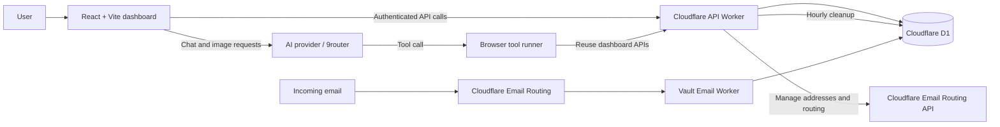

# Vault Architecture

## Main Flows

1. **Vault data:** Dashboard -> API Worker -> D1 -> Dashboard.
2. **AI actions:** Dashboard -> AI provider -> browser tool runner -> existing API Worker routes.
3. **Image generation:** Dashboard -> AI provider -> generated image displayed in the browser. Images are not persisted yet.
4. **Temporary email:** Sender -> Cloudflare Email Routing -> Email Worker -> D1 -> inbox dashboard.
5. **Security:** Sessions, validation, encryption, and authorization are enforced by the API Worker; secrets stay in Cloudflare configuration.

The AI model never receives direct D1 access. It can only request the limited browser tools exposed by Vault.
